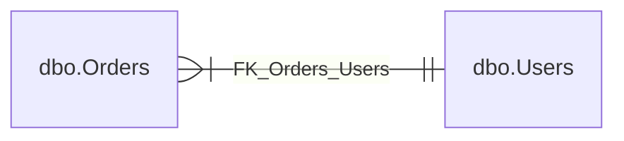
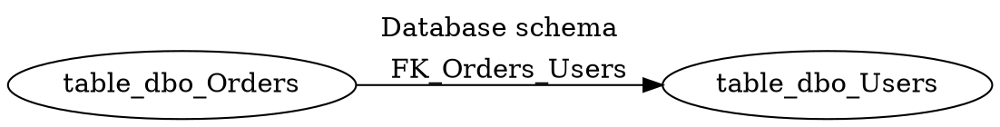

# DbSketch

DbSketch is a small C# CLI tool that reads a live database schema and writes a compact database structure diagram.

The MVP supports SQL Server, PostgreSQL, and MySQL. It reads schemas/namespaces, tables, columns, primary key markers, and real foreign key relationships, then applies include/exclude table filters before rendering DOT or Mermaid.

## Install

### Global tool

```bash
dotnet tool install --global DimonSmart.DbSketch
dbsketch generate --config dbsketch.yml
```

### Local tool in repository

```bash
dotnet new tool-manifest
dotnet tool install DimonSmart.DbSketch --version 0.1.0
dotnet tool restore
dotnet tool run dbsketch -- generate --config dbsketch.yml
```

### One-shot run

```bash
dotnet tool exec DimonSmart.DbSketch@0.1.0 -- generate --config dbsketch.yml
```

With .NET 10, `dnx` can also run the tool:

```bash
dnx DimonSmart.DbSketch@0.1.0 -- generate --config dbsketch.yml
```

### CI example

```yaml
- name: Restore local tools
  run: dotnet tool restore

- name: Generate DB schema diagram
  env:
    DB_CONNECTION: ${{ secrets.DB_CONNECTION }}
  run: dotnet tool run dbsketch -- generate --config dbsketch.yml
```

## Development

Build and test:

```bash
dotnet restore DbSketch.sln
dotnet build DbSketch.sln
dotnet test DbSketch.sln
dotnet pack src/DbSketch.Cli/DbSketch.Cli.csproj -c Release
```

The .NET tool package id is `DimonSmart.DbSketch`; the installed command remains `dbsketch`.

### Git hooks

This repository uses Husky.Net for local Git hooks.

After cloning the repository, run:

```bash
dotnet restore DbSketch.sln
```

The restore step installs local .NET tools and configures Git hooks automatically.

The pre-commit hook formats staged .NET files with `dotnet format` and re-stages only files that were already staged before the hook started.

To skip hooks for a single commit:

```bash
git commit --no-verify
```

To disable Husky installation in CI or special local environments:

```bash
HUSKY=0 dotnet restore DbSketch.sln
```

Direct CLI options can override config values:

```bash
dbsketch generate --provider sqlserver --connection "Server=.;Database=AppDb;Trusted_Connection=True;TrustServerCertificate=True" --out docs/db/schema.dot
```

## Config

```yaml
provider: sqlserver
connectionString: ${DB_CONNECTION}

include:
  tables:
    - "dbo.*"

exclude:
  tables:
    - "dbo.__EFMigrationsHistory"
    - "dbo.Log_*"

output:
  path: docs/db/schema.dot
  format: dot # dot, md-dot, md-graphviz, mermaid, md-mermaid

diagram:
  title: "Database schema"
  rankdir: LR
  compact: true
  show:
    schemaName: true
    columnTypes: false
    nullability: false
    primaryKeys: true
    foreignKeys: true

descriptions:
  enabled: true
```

Provider aliases: `mssql` maps to `sqlserver`, and `postgresql` maps to `postgres`.

When `descriptions.enabled` is true, DbSketch reads database-native table and column comments into the internal schema model.

Current providers:

- SQL Server: `MS_Description` extended properties.
- PostgreSQL: `COMMENT ON TABLE` / `COMMENT ON COLUMN`.
- MySQL: `TABLE_COMMENT` / `COLUMN_COMMENT` from `information_schema`.

The current DOT renderer does not display comments yet. They are collected for upcoming renderers and documentation formats.

## Output Formats

Supported values for `output.format` and `--format`:

- `dot`: raw Graphviz DOT.
- `md-dot`: Markdown with a fenced `dot` block.
- `md-graphviz`: Markdown with a fenced `graphviz` block. Useful for GitLab instances with Kroki enabled.
- `mermaid`: raw Mermaid `erDiagram`.
- `md-mermaid`: Markdown with a fenced `mermaid` block.

For GitLab, prefer `md-mermaid` when you need the most portable output because Mermaid is rendered natively by GitLab. Use `md-graphviz` only when your GitLab instance has Kroki enabled. `md-dot` is preserved for compatibility, but GitLab usually shows `dot` fenced blocks as plain text.

Example GitLab Mermaid config:

```yaml
output:
  path: docs/db/schema.md
  format: md-mermaid
```

Example GitLab Graphviz/Kroki config:

```yaml
output:
  path: docs/db/schema.md
  format: md-graphviz
```



## Manual Integration Tests

DbSketch has explicit manual integration tests that use Testcontainers and require Docker. They are not run by default.

Run them explicitly:

```bash
dotnet test DbSketch.sln --explicit only
dotnet test --filter-method "DimonSmart.DbSketch.Tests.Integration.PostgresNorthwindEndToEndTests.Generate_WithPostgresNorthwind_WritesDotSchema" --explicit only
dotnet test --filter-method "DimonSmart.DbSketch.Tests.Integration.PostgresCommentsTests.ReadAsync_WhenReadCommentsIsTrue_ReadsTableAndColumnComments" --explicit only
```

## Example DOT



## Not Supported Yet

DbSketch does not render comments in DOT yet, render SVG/PNG, run Graphviz or Mermaid CLI, generate DBML or PlantUML, infer relationships by naming convention, generate HTML docs, diff schemas, or provide a GUI.
