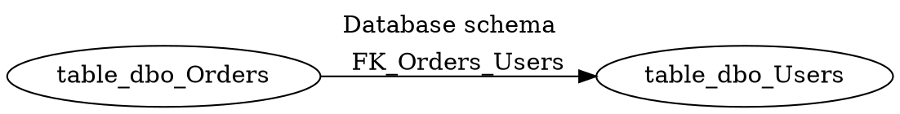

# DbSketch

DbSketch is a small C# CLI tool that reads a live database schema and writes a compact Graphviz DOT diagram.

The MVP supports SQL Server, PostgreSQL, and MySQL. It reads schemas/namespaces, tables, columns, primary key markers, and real foreign key relationships, then applies include/exclude table filters before rendering DOT.

## Install

### Global tool

```bash
dotnet tool install --global DbSketch
dbsketch generate --config dbsketch.yml
```

### Local tool in repository

```bash
dotnet new tool-manifest
dotnet tool install DbSketch --version 0.1.0
dotnet tool restore
dotnet tool run dbsketch -- generate --config dbsketch.yml
```

### One-shot run

```bash
dotnet tool exec DbSketch@0.1.0 -- generate --config dbsketch.yml
```

With .NET 10, `dnx` can also run the tool:

```bash
dnx DbSketch@0.1.0 -- generate --config dbsketch.yml
```

### CI example

```yaml
- name: Restore local tools
  run: dotnet tool restore

- name: Generate DB schema diagram
  env:
    DB_CONNECTION: ${{ secrets.DB_CONNECTION }}
  run: dotnet tool run dbsketch -- generate --config dbsketch.yml
```

## Development

Build and test:

```bash
dotnet restore DbSketch.sln
dotnet build DbSketch.sln
dotnet test DbSketch.sln
dotnet pack src/DbSketch.Cli/DbSketch.Cli.csproj -c Release
```

Direct CLI options can override config values:

```bash
dbsketch generate --provider sqlserver --connection "Server=.;Database=AppDb;Trusted_Connection=True;TrustServerCertificate=True" --out docs/db/schema.dot
```

## Config

```yaml
provider: sqlserver
connectionString: ${DB_CONNECTION}

include:
  tables:
    - "dbo.*"

exclude:
  tables:
    - "dbo.__EFMigrationsHistory"
    - "dbo.Log_*"

output:
  path: docs/db/schema.dot
  format: dot

diagram:
  title: "Database schema"
  rankdir: LR
  compact: true
  show:
    schemaName: true
    columnTypes: false
    nullability: false
    primaryKeys: true
    foreignKeys: true

descriptions:
  enabled: false
```

Provider aliases: `mssql` maps to `sqlserver`, and `postgresql` maps to `postgres`.

## Markdown DOT

Use `format: md-dot` or `--format md-dot` to write Markdown with a fenced `dot` block instead of a raw `.dot` file.

## Manual Integration Tests

DbSketch has explicit manual integration tests that use Testcontainers and require Docker. They are not run by default.

Run them explicitly:

```bash
dotnet test --filter-method "DbSketch.Tests.Integration.PostgresNorthwindEndToEndTests.Generate_WithPostgresNorthwind_WritesDotSchema" --explicit only
```

## Example DOT



## Not Supported Yet

DbSketch does not render SVG/PNG, run Graphviz, generate Mermaid/DBML, infer relationships by naming convention, read database comments, generate HTML docs, diff schemas, or provide a GUI.
