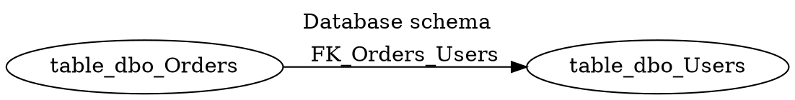

# DbSketch

DbSketch is a small C# CLI tool that reads a live database schema and writes a compact Graphviz DOT diagram.

The MVP supports SQL Server, PostgreSQL, and MySQL. It reads schemas/namespaces, tables, columns, primary key markers, and real foreign key relationships, then applies include/exclude table filters before rendering DOT.

## Install and Run

Build and test:

```bash
dotnet restore
dotnet build
dotnet test
dotnet pack src/DbSketch.Cli/DbSketch.Cli.csproj -c Release
```

One-shot run after packing from the local package source:

```bash
dotnet tool exec --source ./src/DbSketch.Cli/bin/Release dbsketch -- generate --config samples/sqlserver/dbsketch.yml
```

Expected package command:

```bash
dnx dbsketch generate --config dbsketch.yml
```

Alternative:

```bash
dotnet tool exec dbsketch -- generate --config dbsketch.yml
```

Direct CLI options can override config values:

```bash
dbsketch generate --provider sqlserver --connection "Server=.;Database=AppDb;Trusted_Connection=True;TrustServerCertificate=True" --out docs/db/schema.dot
```

## Config

```yaml
provider: sqlserver
connectionString: ${DB_CONNECTION}

include:
  tables:
    - "dbo.*"

exclude:
  tables:
    - "dbo.__EFMigrationsHistory"
    - "dbo.Log_*"

output:
  path: docs/db/schema.dot
  format: dot

diagram:
  title: "Database schema"
  rankdir: LR
  compact: true
  show:
    schemaName: true
    columnTypes: false
    nullability: false
    primaryKeys: true
    foreignKeys: true

descriptions:
  enabled: false
```

Provider aliases: `mssql` maps to `sqlserver`, and `postgresql` maps to `postgres`.

## Markdown DOT

Use `format: md-dot` or `--format md-dot` to write Markdown with a fenced `dot` block instead of a raw `.dot` file.

## Example DOT



## Not Supported Yet

DbSketch does not render SVG/PNG, run Graphviz, generate Mermaid/DBML, infer relationships by naming convention, read database comments, generate HTML docs, diff schemas, or provide a GUI.
