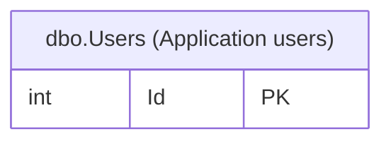
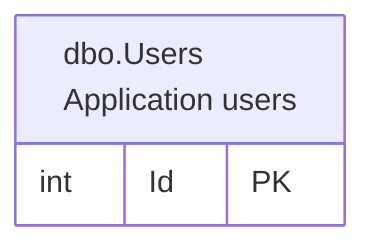

# Database Comments

DbSketch can read database-native table and column comments and include them in supported renderers.

Enable comment reading:

```yaml
comments:
  enabled: true
```

Provider support:

- SQL Server: `MS_Description` extended properties.
- PostgreSQL: `COMMENT ON TABLE` and `COMMENT ON COLUMN`.
- MySQL: `TABLE_COMMENT` and `COLUMN_COMMENT` from `information_schema`.
- SQLite: no native comment reader; use YAML comment overrides.

## Overrides

YAML overrides can replace or add table and column comments. Overrides are applied even when database comment reading is disabled.

```yaml
comments:
  enabled: true
  overrides:
    tables:
      - schema: dbo
        name: Users
        comment: Application users
        columns:
          Id: Internal user identifier
          Email: Login email
```

SQLite databases do not have native table or column comments. Use the SQLite schema name in overrides; for a normal database file, that schema is `main`:

```yaml
comments:
  overrides:
    tables:
      - schema: main
        name: products
        comment: Product catalog
        columns:
          category_id: Category reference
```

## Rendering

```yaml
defaults:
  diagram:
    columnLayout: "{name} | {type} | {keys} | {comment}"
    show:
      tableComments: true
    comments:
      maxLength: 80
```

DOT supports table comments through the default header or `tableHeaderLayout`, and column comments through `{comment}` in `columnLayout`.
Mermaid ER supports column comments when `columnLayout` contains `{comment}`.
Mermaid ER renders table comments as part of the entity display label using Mermaid entity aliases. This requires Mermaid 10.5.0 or newer.

By default, the table comment is appended in parentheses:



For Mermaid, set `diagram.mermaid.tableCommentsOnNewLine: true` to put an enabled table comment on a separate visual line. `diagram.show.tableComments` still controls whether table comments are shown at all.

```yaml
defaults:
  diagram:
    show:
      tableComments: true
    mermaid:
      tableCommentsOnNewLine: true
```

This produces a Mermaid entity alias using `<br>`:



`diagram.comments.maxLength` limits rendered comments after inline whitespace normalization. It is optional; by default comments are not truncated.
