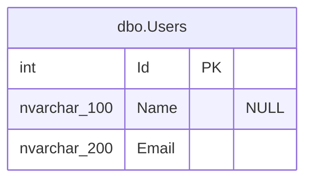

# Configuration

DbSketch uses a YAML config file with one database connection and optional named diagram targets. Only `provider` and `connectionString` are required; almost all other settings have defaults.

## Minimal config

```yaml
provider: postgres
connectionString: "${DB_CONNECTION}"
```

## Default generated diagram

If `diagrams` is omitted or empty, DbSketch generates one Mermaid diagram named `main`, wraps it in Markdown, and writes it to:

```text
docs/db/schema.md
```

Main defaults:

| Option | Default |
| --- | --- |
| `defaults.output.format` | `markdown` |
| `defaults.diagram.renderer` | `mermaid` |
| `defaults.diagram.direction` | `LR` |
| `defaults.diagram.columnLayout` | `{name} \| {type} \| {keys} \| {nullable}` |
| `diagrams` | one diagram named `main` |
| default output path | `docs/db/schema.md` |

For a larger configuration that combines comments, defaults, multiple diagrams, raw output, Mermaid, and DOT styling, see [Full config example](examples/full-config.md).

## Provider

Supported providers:

- `sqlserver`
- `postgres`
- `mysql`
- `sqlite`

Provider aliases:

- `mssql` maps to `sqlserver`
- `postgresql` maps to `postgres`
- `sqlite3` maps to `sqlite`

SQLite example:

```yaml
provider: sqlite
connectionString: "Data Source=app.db;Mode=ReadOnly"
```

For existing SQLite databases, prefer `Mode=ReadOnly` so a mistyped path fails instead of creating an empty database. Plain `Data Source=app.db` is useful for tests and temporary scenarios where creating the file is expected.

SQLite tables are exposed under the SQLite database schema name. For normal file and in-memory databases, use `main` in filters:

```yaml
include:
  tables:
    - "main.*"
```

## Environment Variables

DbSketch expands `${NAME}` placeholders before YAML is parsed:

```yaml
connectionString: "${DB_CONNECTION}"
```

A fallback value can be provided:

```yaml
connectionString: "${DB_CONNECTION:-Host=localhost;Database=app}"
```

Wrap placeholders in YAML quotes. Connection strings often contain `:`, `;`, `#`, spaces, backslashes, or other characters with special YAML meaning.

## Diagrams

When `diagrams` is omitted or empty, DbSketch creates the default `main` diagram. Explicit diagrams must define a unique `name`. If `output.path` is omitted, DbSketch writes to `docs/db/{name}.md` for Markdown output, or to `.mmd` / `.dot` for raw Mermaid / DOT output. The default `main` filename is `schema`.

If `include.tables` is empty or omitted, the diagram includes all tables except excluded tables.

Foreign keys are rendered only when both related tables are included in that diagram.

Use per-diagram overrides when one diagram needs different output or renderer settings:

```yaml
diagrams:
  - name: full-dot
    diagram:
      renderer: dot
    output:
      path: docs/db/full.dot
      format: raw

  - name: full-mermaid
    diagram:
      renderer: mermaid
      mermaid:
        emitDirection: false
    output:
      path: docs/db/full.mmd
      format: raw
```

Supported output formats:

- `raw`: write only diagram text.
- `markdown`: wrap diagram text in a fenced Markdown code block.

Supported diagram renderers:

- `dot`: Graphviz DOT.
- `mermaid`: Mermaid ER.

## Column Layout

`columnLayout` controls which column attributes are shown and in what order. It defaults to `{name} | {type} | {keys} | {nullable}` and must contain `{name}` when configured.

DOT uses `columnLayout` as a full table layout. The `|` character separates table cells; use `\|` for a literal pipe and `\\` for a literal backslash.

Mermaid uses the same `columnLayout` as a logical projection and maps supported tokens to valid Mermaid ER attribute syntax. The `|` character only separates logical fields for Mermaid; Mermaid decides how attributes are displayed.

```yaml
defaults:
  diagram:
    renderer: mermaid
    columnLayout: "{name} | {type} | {keys} | {nullable}"
```

Supported column tokens:

- `{name}`: column name.
- `{type}`: database/store type.
- `{nullable}`: `NULL` for nullable columns, otherwise empty.
- `{nullability}`: `NULL` or `NOT NULL`.
- `{pk}`: `PK` for primary key columns, otherwise empty.
- `{fk}`: `FK` for foreign key columns, otherwise empty.
- `{keys}`: `PK`, `FK`, `PK FK`, or empty.
- `{idx}`: `IDX` for one simple index, `UQ` for one simple unique index, `*` for complex index participation, otherwise empty. This is a compact DOT-only hint; see the Markdown Indexes section for full details.
- `{comment}`: column comment, normalized and truncated by `defaults.diagram.comments.maxLength` when configured.

Mermaid projection rules:

- `{name}` is required and becomes the Mermaid attribute name.
- `{type}` becomes the Mermaid attribute type. If omitted, DbSketch emits the stable placeholder type `column`.
- `{keys}`, `{pk}`, and `{fk}` control Mermaid `PK` and `FK` markers.
- `{comment}` controls Mermaid attribute comments.
- `{idx}` is intentionally ignored by Mermaid ER.
- `{nullable}` renders nullable columns as the Mermaid attribute comment `"NULL"`.
- `{nullability}` renders full nullability as Mermaid attribute comments: `"NULL"` or `"NOT NULL"`.

Default Mermaid output marks only nullable columns:



Examples:

```yaml
columnLayout: "{name} | {pk}"
columnLayout: "{name} | {pk} | {fk}"
columnLayout: "{name} | {keys}"
columnLayout: "{name} | {type} | {keys} | {nullable}"
columnLayout: "{name}: {type} | {keys}"
columnLayout: "{name} :: {type} | {keys}"
columnLayout: "{name:bold,font=Times} {type:color=#666666}\n{comment:color=#666666,fontSize=9} | {keys}"
```

Tokens can include safe style modifiers:

- `bold`
- `italic`
- `color=#RRGGBB`
- `font=Font Name`
- `fontSize=9`

Style modifiers, real table cells, and multiline cells are DOT-only. Mermaid ignores valid style modifiers and multiline structure while preserving token meaning.

This is not raw HTML. DbSketch generates Graphviz HTML-like labels internally and escapes database values and literal layout text.

Column text output is controlled by `columnLayout`. Foreign key relationships are still rendered independently from the text layout.

## Table Header Layout

DOT renderer can use `tableHeaderLayout` to control the table header cells. Mermaid ignores `tableHeaderLayout`.

```yaml
defaults:
  diagram:
    tableHeaderLayout: "{schema}.{table} | {comment}"
```

Supported table header tokens:

- `{schema}`: schema name.
- `{table}`: table name.
- `{name}`: alias for `{table}`.
- `{fullName}`: `schema.table`.
- `{comment}`: table comment, normalized and truncated by `defaults.diagram.comments.maxLength` when configured.

Examples:

```yaml
tableHeaderLayout: "{fullName}"
tableHeaderLayout: "{schema} | {table}"
tableHeaderLayout: "{table}"
tableHeaderLayout: "{fullName} - {comment}"
tableHeaderLayout: "{fullName} | {comment}"
tableHeaderLayout: "{table:bold}\n{comment:color=#666666,fontSize=9}"
```

Diagram targets can override default layout settings:

```yaml
diagrams:
  - name: detailed
    output:
      path: docs/db/detailed.dot
    diagram:
      columnLayout: "{name}: {type} {nullability} | {keys}"
      tableHeaderLayout: "{schema} | {table} | {comment}"
```

The same `columnLayout` string can be used when switching between DOT and Mermaid. `tableHeaderLayout` remains DOT-only.

## DOT styling

For DOT output, `diagram.style` selects a Graphviz style preset:

```yaml
defaults:
  diagram:
    renderer: dot
    style: readable
```

Supported styles: `classic`, `readable`, `compact`, `soft`, `blueprint`, and `contrast`.

Use styled `columnLayout` and `tableHeaderLayout` for DOT-specific typography. For style preset details, low-level Graphviz options, and image generation, see [Renderers](renderers.md#dot-styling).
