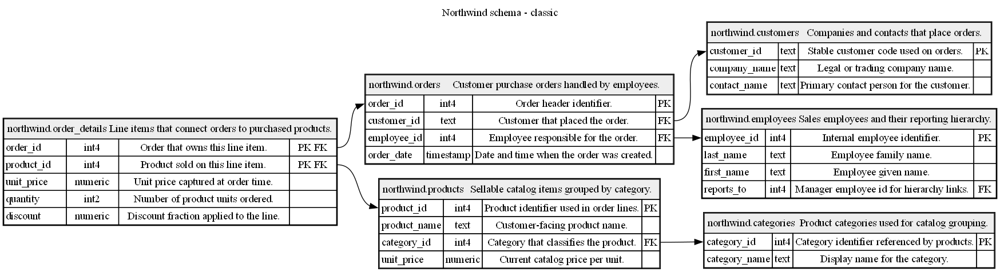
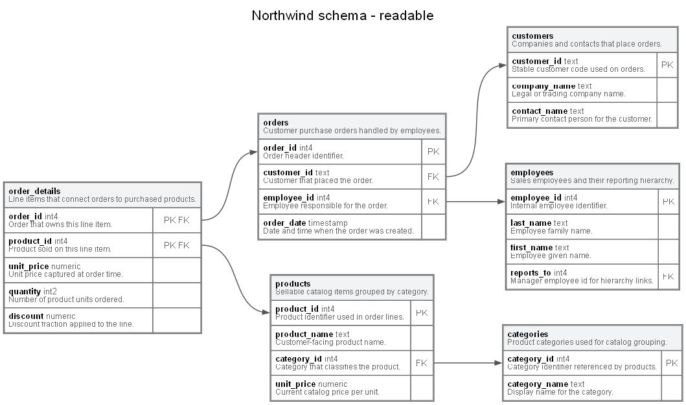
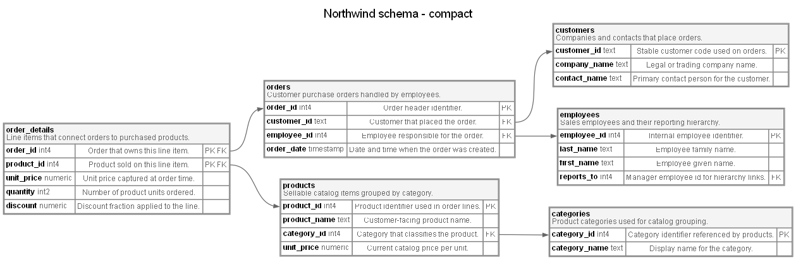
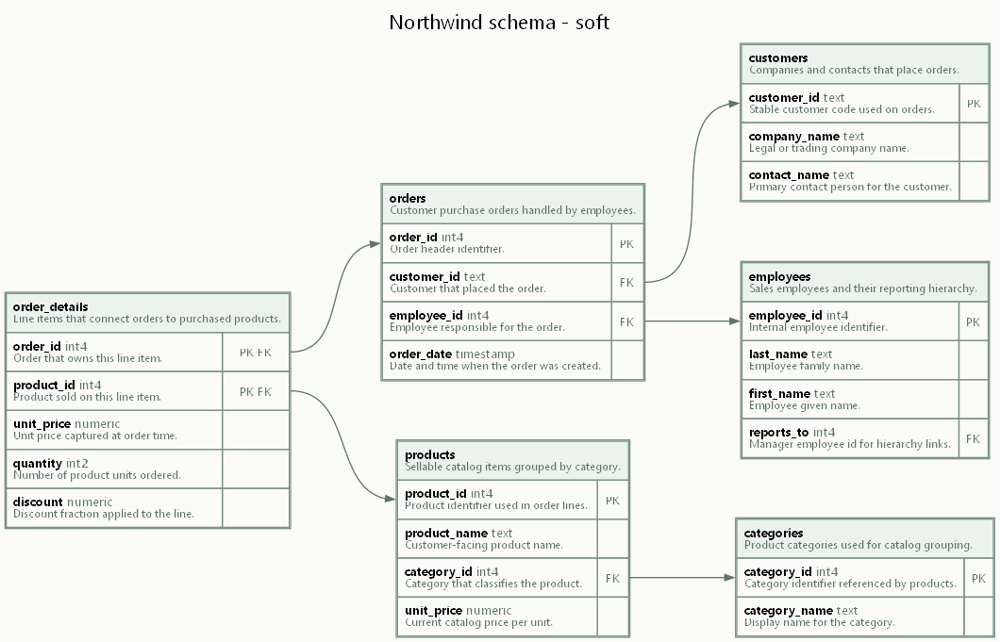
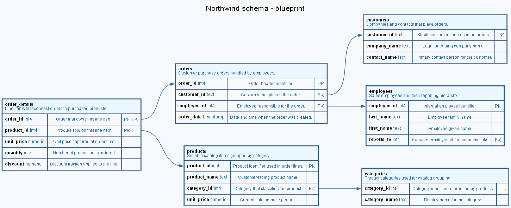
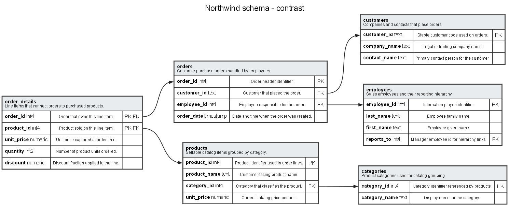

# DOT Style Presets

DbSketch supports these `diagram.style` presets for DOT output: `classic`, `readable`, `compact`, `soft`, `blueprint`, and `contrast`.

The examples below use the Northwind PostgreSQL test fixture and are generated from DbSketch DOT output with Graphviz.

## classic

[Generated classic style DOT](northwind.style.classic.dot)

## readable

[Generated readable style DOT](northwind.style.readable.dot)

## compact

[Generated compact style DOT](northwind.style.compact.dot)

## soft

[Generated soft style DOT](northwind.style.soft.dot)

## blueprint

[Generated blueprint style DOT](northwind.style.blueprint.dot)

## contrast

[Generated contrast style DOT](northwind.style.contrast.dot)

See the base [Northwind example](northwind.md) for compact DOT, full DOT, Mermaid, and Markdown output examples.
