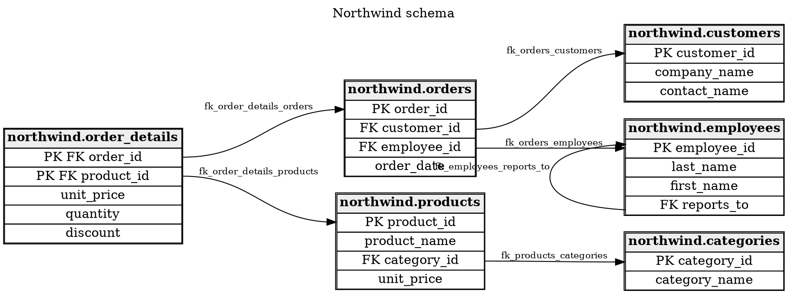

# Northwind DbSketch generated output

This file is generated from the Northwind PostgreSQL test fixture.

```dot
digraph DbSketch {
  graph [
    rankdir=LR,
    labelloc="t",
    label="Northwind schema"
  ];

  node [
    shape=plain
  ];

  edge [
    fontsize=10
  ];

  "table_northwind_categories" [
    label=<
      <TABLE BORDER="1" CELLBORDER="1" CELLSPACING="0">
        <TR><TD BGCOLOR="#EEEEEE"><B>northwind.categories</B></TD></TR>
        <TR><TD PORT="col_category_id">PK category_id</TD></TR>
        <TR><TD PORT="col_category_name">category_name</TD></TR>
      </TABLE>
    >
  ];

  "table_northwind_customers" [
    label=<
      <TABLE BORDER="1" CELLBORDER="1" CELLSPACING="0">
        <TR><TD BGCOLOR="#EEEEEE"><B>northwind.customers</B></TD></TR>
        <TR><TD PORT="col_customer_id">PK customer_id</TD></TR>
        <TR><TD PORT="col_company_name">company_name</TD></TR>
        <TR><TD PORT="col_contact_name">contact_name</TD></TR>
      </TABLE>
    >
  ];

  "table_northwind_employees" [
    label=<
      <TABLE BORDER="1" CELLBORDER="1" CELLSPACING="0">
        <TR><TD BGCOLOR="#EEEEEE"><B>northwind.employees</B></TD></TR>
        <TR><TD PORT="col_employee_id">PK employee_id</TD></TR>
        <TR><TD PORT="col_last_name">last_name</TD></TR>
        <TR><TD PORT="col_first_name">first_name</TD></TR>
        <TR><TD PORT="col_reports_to">FK reports_to</TD></TR>
      </TABLE>
    >
  ];

  "table_northwind_orders" [
    label=<
      <TABLE BORDER="1" CELLBORDER="1" CELLSPACING="0">
        <TR><TD BGCOLOR="#EEEEEE"><B>northwind.orders</B></TD></TR>
        <TR><TD PORT="col_order_id">PK order_id</TD></TR>
        <TR><TD PORT="col_customer_id">FK customer_id</TD></TR>
        <TR><TD PORT="col_employee_id">FK employee_id</TD></TR>
        <TR><TD PORT="col_order_date">order_date</TD></TR>
      </TABLE>
    >
  ];

  "table_northwind_order_details" [
    label=<
      <TABLE BORDER="1" CELLBORDER="1" CELLSPACING="0">
        <TR><TD BGCOLOR="#EEEEEE"><B>northwind.order_details</B></TD></TR>
        <TR><TD PORT="col_order_id">PK FK order_id</TD></TR>
        <TR><TD PORT="col_product_id">PK FK product_id</TD></TR>
        <TR><TD PORT="col_unit_price">unit_price</TD></TR>
        <TR><TD PORT="col_quantity">quantity</TD></TR>
        <TR><TD PORT="col_discount">discount</TD></TR>
      </TABLE>
    >
  ];

  "table_northwind_products" [
    label=<
      <TABLE BORDER="1" CELLBORDER="1" CELLSPACING="0">
        <TR><TD BGCOLOR="#EEEEEE"><B>northwind.products</B></TD></TR>
        <TR><TD PORT="col_product_id">PK product_id</TD></TR>
        <TR><TD PORT="col_product_name">product_name</TD></TR>
        <TR><TD PORT="col_category_id">FK category_id</TD></TR>
        <TR><TD PORT="col_unit_price">unit_price</TD></TR>
      </TABLE>
    >
  ];

  "table_northwind_employees":"col_reports_to" -> "table_northwind_employees":"col_employee_id" [
    label="fk_employees_reports_to"
  ];
  "table_northwind_orders":"col_customer_id" -> "table_northwind_customers":"col_customer_id" [
    label="fk_orders_customers"
  ];
  "table_northwind_orders":"col_employee_id" -> "table_northwind_employees":"col_employee_id" [
    label="fk_orders_employees"
  ];
  "table_northwind_order_details":"col_order_id" -> "table_northwind_orders":"col_order_id" [
    label="fk_order_details_orders"
  ];
  "table_northwind_order_details":"col_product_id" -> "table_northwind_products":"col_product_id" [
    label="fk_order_details_products"
  ];
  "table_northwind_products":"col_category_id" -> "table_northwind_categories":"col_category_id" [
    label="fk_products_categories"
  ];
}
```
