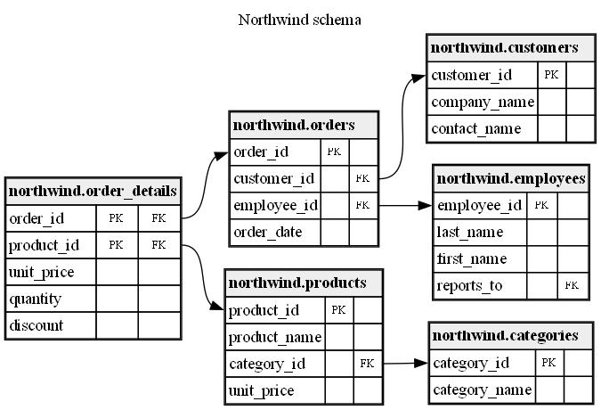

# Northwind DbSketch Example

This example shows a small Northwind-like PostgreSQL schema with customers, employees, categories, products, orders, and order details.



The sample is generated from the test fixture at:

```text
tests/DbSketch.Tests/TestData/Northwind/postgres-northwind-schema.sql
```

Example files:

- [Northwind DbSketch config](northwind.dbsketch.yml)
- [Generated DOT](northwind.dot)
- [Generated README DOT](northwind.readme.dot)
- [Generated Mermaid ER](northwind.mmd)
- [Generated Markdown](northwind.generated.md)

The PNG image is generated from DbSketch DOT output with Graphviz.
