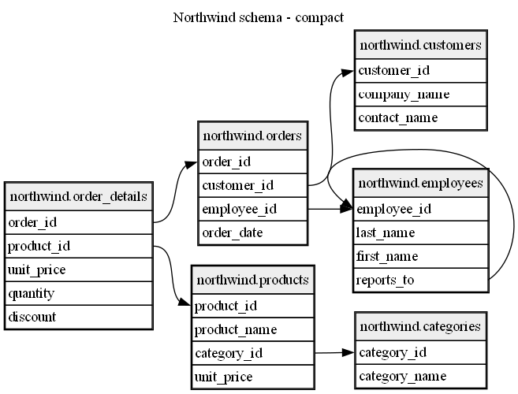
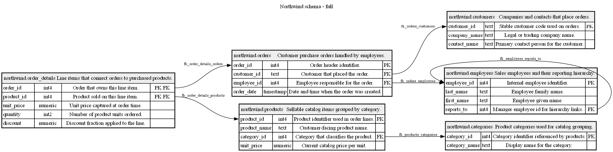
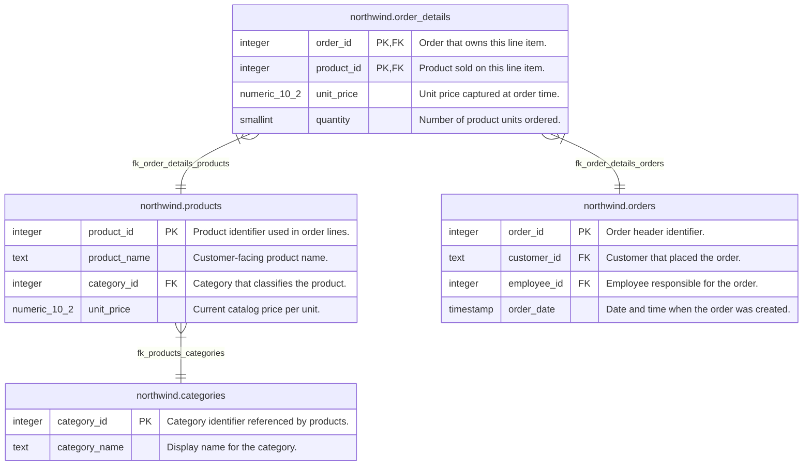
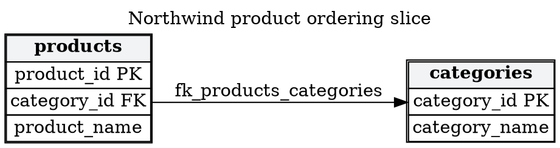

# Northwind DbSketch Example

This example shows a small Northwind-like PostgreSQL schema with customers, employees, categories, products, orders, and order details.

The schema is based on the classic Northwind sample database originally popularized by Microsoft.

## Compact DOT layout

```yaml
tableHeaderLayout: "{fullName}"
columnLayout: "{name}"
show:
  foreignKeyLabels: false
```



## Full DOT layout

```yaml
tableHeaderLayout: "{fullName} | {comment}"
columnLayout: "{name} | {type} | {comment} | {keys}"
show:
  foreignKeyLabels: true
  tableComments: true
```



## Native Markdown rendering

DbSketch can also write Markdown files that contain fenced diagram source. If your documentation platform supports the fence language, the block below is rendered as a diagram. If it does not, you will see the source code, which can still be copied into a renderer.

### Mermaid ER

This is the same Northwind schema rendered as Mermaid ER. GitHub and many documentation systems render `mermaid` fences natively.


```mermaid
erDiagram

  "northwind.categories" {
    integer category_id PK "Category identifier referenced by products."
    text category_name "Display name for the category."
  }

  "northwind.products" {
    integer product_id PK "Product identifier used in order lines."
    text product_name "Customer-facing product name."
    integer category_id FK "Category that classifies the product."
    numeric_10_2 unit_price "Current catalog price per unit."
  }

  "northwind.orders" {
    integer order_id PK "Order header identifier."
    text customer_id FK "Customer that placed the order."
    integer employee_id FK "Employee responsible for the order."
    timestamp order_date "Date and time when the order was created."
  }

  "northwind.order_details" {
    integer order_id PK, FK "Order that owns this line item."
    integer product_id PK, FK "Product sold on this line item."
    numeric_10_2 unit_price "Unit price captured at order time."
    smallint quantity "Number of product units ordered."
  }

  "northwind.products" }|--|| "northwind.categories" : "fk_products_categories"
  "northwind.order_details" }|--|| "northwind.orders" : "fk_order_details_orders"
  "northwind.order_details" }|--|| "northwind.products" : "fk_order_details_products"
```

### DOT / Graphviz

This is a compact DOT example. Platforms with a DOT/Graphviz renderer, including Dotvis-style integrations, can render the `dot` fence as a diagram. Other platforms show the source code.


```dot
digraph DbSketch {
  graph [
    rankdir=LR,
    labelloc="t",
    label="Northwind product ordering slice"
  ];

  node [
    shape=plain
  ];

  "table_categories" [
    label=<
      <TABLE BORDER="1" CELLBORDER="1" CELLSPACING="0">
        <TR><TD BGCOLOR="#F1F3F5"><B>categories</B></TD></TR>
        <TR><TD PORT="category_id">category_id PK</TD></TR>
        <TR><TD>category_name</TD></TR>
      </TABLE>
    >
  ];

  "table_products" [
    label=<
      <TABLE BORDER="1" CELLBORDER="1" CELLSPACING="0">
        <TR><TD BGCOLOR="#F1F3F5"><B>products</B></TD></TR>
        <TR><TD PORT="product_id">product_id PK</TD></TR>
        <TR><TD PORT="category_id_fk">category_id FK</TD></TR>
        <TR><TD>product_name</TD></TR>
      </TABLE>
    >
  ];

  "table_products":"category_id_fk":e -> "table_categories":"category_id":w [
    label="fk_products_categories"
  ];
}
```

The generated Markdown example file uses the same wrapper behavior:

- [Generated Markdown with DOT fence](northwind.generated.md)
- [Generated Mermaid ER source](northwind.mmd)

For a visual comparison of DOT styles, see [DOT style presets](dot-styles.md).

The sample is generated from the test fixture at:

```text
tests/DbSketch.Tests/TestData/Northwind/postgres-northwind-schema.sql
```

Example files:

- [Northwind DbSketch config](northwind.dbsketch.yml)
- [Generated compact DOT](northwind.compact.dot)
- [Generated full DOT](northwind.full.dot)
- [Generated DOT](northwind.dot)
- [Generated README DOT](northwind.readme.dot)
- [Generated Mermaid ER](northwind.mmd)
- [Generated Markdown](northwind.generated.md)

The PNG images are generated from DbSketch DOT output with Graphviz.
